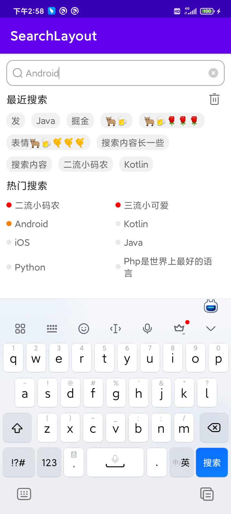

# SearchLayout

一个超简单的Android搜索框，带有热门搜索和最近搜索哦，多种动态属性，满足多种需求！

#### 效果图



#### 完整的使用方式，可以查看下面的文章详解。

[点击直达](https://juejin.cn/post/7163844676556947464)

## 快速使用

1、在你的根项目下的build.gradle文件下，引入maven。

```groovy
allprojects {
    repositories {
        maven { url "https://gitee.com/AbnerAndroid/almighty/raw/master" }
    }
}
```
2、在你需要使用的Module中build.gradle文件下，引入依赖。

```groovy
dependencies {
    implementation 'com.vip:search:1.0.0'
}
```
3、xml中引入

```xml
 <com.vip.search.SearchLayout
        android:id="@+id/search_layout"
        android:layout_width="match_parent"
        android:layout_height="40dp"
        android:layout_marginTop="10dp"
        app:layout_constraintLeft_toLeftOf="parent"
        app:layout_constraintTop_toTopOf="parent"
        app:search_bg="@drawable/shape_stroke_10" />

    <com.vip.search.SearchList
        android:id="@+id/search_list"
        android:layout_width="match_parent"
        android:layout_height="wrap_content"
        android:layout_marginTop="10dp"
        app:is_hot_flex_box_or_grid="true"
        app:is_visibility_history_clear="true"
        app:layout_constraintTop_toBottomOf="@id/search_layout" />
```

## 欢迎关注作者

微信搜索【App开发干货铺】，或扫描下面二维码关注，查阅更多技术文章！


## 赞赏作者

看在作者这么努力的份上，微信赞赏随意，给个鼓励好不好~


## License

```
Copyright (C) AbnerMing, SearchLayout Open Source Project

Licensed under the Apache License, Version 2.0 (the "License");
you may not use this file except in compliance with the License.
You may obtain a copy of the License at

     http://www.apache.org/licenses/LICENSE-2.0

Unless required by applicable law or agreed to in writing, software
distributed under the License is distributed on an "AS IS" BASIS,
WITHOUT WARRANTIES OR CONDITIONS OF ANY KIND, either express or implied.
See the License for the specific language governing permissions and
limitations under the License.
```
